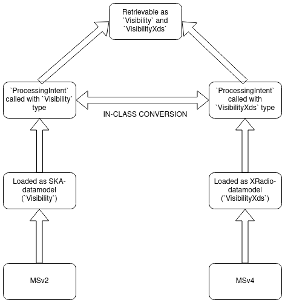

.. _measurement_set:

****************
Measurement Sets
****************

Measurement Set loading
=======================
The pipeline accepts both MSv2 and MSv4 as an input Measurement Set format. 

MSv2 are loaded as SKA-datamodels; specifically, the function `create_visibility_from_ms()`` in `ska-sdp-datamodels` is deployed to read MSv2 and return `list[Visibility]` data type. Note that `Visibility` is a schema of `xarray.Dataset` data-type.

MSv4 are loaded as XRadio-Datamodels; specifically, the function `read_processing_set()` in `xradio` is deployed to read MSv4 and return `list[VisibilityXds]` data type. Note that `VisibilityXds` is a schema of `xarray.Dataset` data type. Also note that `xradio` is currently still in active development; therefore, the in-memory data-model might utilise either `VisibilityXds` or `xarray.Dataset` types. 

In-memory data handling of Measurement Sets
===========================================

The `ProcessingIntent` class
----------------------------
As highlighted above, this pipeline can read both MSv2 and MSv4, and it does this via trying to deploy `ska_sdp_datamodels` and `xradio` consecutively on the data. Hence, no prior definition/guidance is needed by the pipeline to determine whether the input provided is MSv2 or MSv4.

The MS data is loaded either as `list[Visibility]` (for MSv2) or `list[VisibilityXds]` (for MSv4). Nonetheless, to unify the in-memory data representation for both MSv2 and MSv4, the pipeline defines the in-memory Measurement Set data as a `list[ProcessingIntent]` data type. 
`ProcessingIntent` is an internal class that can be called with either `Visibility` or `VisibilityXds` inputs. If the data is loaded as `Visibility`, it can be retained via calling the `data_as_ska_vis` attribute of the class. Similarly, if the data is loaded as `VisibilityXds`, it can be retained by calling the `data_as_xradio_vis` attribute.

Furthermore, `ProcessingIntent` utilises the new `ska_sdp_datamodels` functions useful in converting `Visibility` to `VisibilityXds` and vice versa. This means that, as long as these `ska_sdp_datamodels` functions work, one can load the data into `ProcessingIntent` as `Visibility` yet retrieve it as `VisibilityXds` (via calling the `data_as_xradio_vis` attribute). Similarly, data can be loaded as `VisibilityXds` and retained as `Visibility` (via calling the `data_as_ska_vis` attribute). 
The following section covers further information about this.

`Visibility` <-> `VisibilityXds` convertibility
-----------------------------------------------
The primary use case of having a `ProcessingIntent` class is to unify the loading of data from MSv2 and MSv4. As described above, data from MSv2 can be loaded yet retrieved as in-memory MSv4-compatible data types, and vice versa. Therefore, it is hoped that this architecture entailing the use of `ProcessingIntent` will enable various operations/tests in this pipeline and further pipelines, which may require data-chunking and/or in-memory MSv2 ↔ MSv4 conversions.

Note that, because `xradio` is in active development, the `Visibility` <-> `VisibilityXds` conversion functions will only work if the relevant functions from `ska_sdp_datamodels` are operational. While these are being actively maintained, the consistent updates to `xradio` might hinder these from being fully operational as of yet. Nevertheless, note that the loaded data type is always retrievable; for example, if the loaded MS is version 2, and so it is loaded as `Visibility` type, calling `data_as_ska_vis` should always work. 
Similarly, if the loaded MS is version 4, and so it is loaded as `VisibilityXds`  type, calling `data_as_xradio_vis` should always work.

Schematic for in-memory Measurement Set data
--------------------------------------------

Converting Measurement Sets from v2 to v4 on disk
=================================================
The pipeline also provides an interface to convert MSv2 to MSv4 via `xradio`. List the option `convert_msv2_to_msv4:` in your `.yml` configuration file to enable this operation. This is a standalone operation that will not interfere with other processing functions.
All relevant `xradio` optional arguments can also be passed as sub-commands here (https://github.com/casangi/xradio/blob/a0abbd879a6cd0fcbd1580201f4841125dd2a6ed/src/xradio/vis/convert_msv2_to_processing_set.py#L11). Take care not to conflict the operations of this pipeline as described here with external optional arguments.

Writing Measurement Sets
========================
The pipeline enables exporting in-memory data as MSv2 on disk using `ska-sdp-datamodels`. Writing MSv4 is currently a more complex endeavour that requires the existence of suitable packages. Therefore, care should be taken that, if the loaded MS is version 4, and the `Visibility` <-> `VisibilityXds` convertibility is hindered/non-operational, 
then this pipeline will not be able to write MSv2 on disk. In such a case, one should exclusively load MSv2 into this pipeline.

A word of caution
=================

MSv4 considerations
-------------------
Given that `xradio` is currently in rapid development (as of Sept 2024), there are a couple of risks associsted with loading MSv4 into the pipeline:

 * The architecture of MSv4 directories and/or operation logic of `xradio` could change rapidly so as to hinder successful loading of your MSv4.

 * The `ska-sdp-datamodels` functions internally handling in-memory `Visibility` <-> `VisibilityXds` conversions can also be affected by the rapid change in `xradio`. This means that, even if MSv4 is successfully loaded into memory a risk persists of not being able to retrieve the data as SKA-datamodels format, which, in turn, hinders exporting
   the in-memory data as MSv2 by relevant `ska-sdp-datamodels` functions.

VLA data
--------
It has been noticed that the pipeline fails to load some VLA data, and the error arises from `ska-sdp-datamodels`.