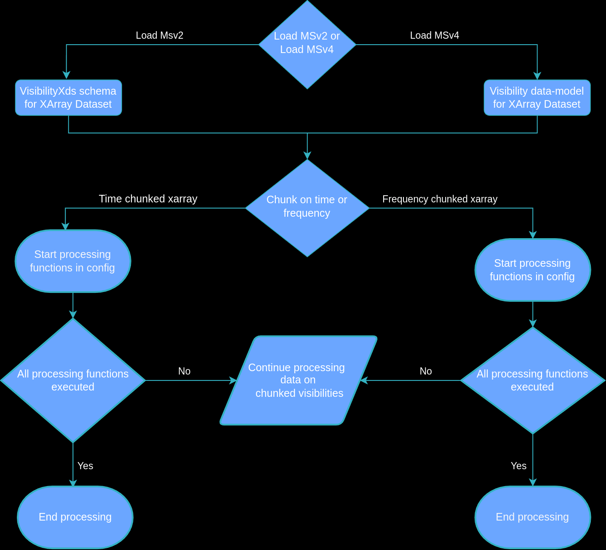

.. _pipeline:

**************
Pipeline Usage
**************

Introduction
============

Preprocessing is a step mostly to be executed before calibration and imaging. As a consequence of the high sensitivity of radio interferometers, the signal received is highly
susceptible to radio frequency interfernce (RFI) which needs to be removed. Additonally especially in low frequency interferometers, the signal is dominated by a few sources which need to be removed.
There is also the need to reduce the overall computational cost of the entire data reduction pipeline and decreasing the noise level of the signal. To achieve these tasks, the following
processing steps are executed:

* RFI-Masking - Masks the frequencies containing interference.
* RFI-Flagging - Detects the frequencies containing interference and flags them to be ignored in further processing stages. 
* Time Averaging - Averages the data on the time axis.
* Frequency Averaging - Averages the data on the frequency axis.
* Demixing - Detects and carefully removes the impact of bright sources from the data.

The pipeline here aims to distribute these processing steps on multiple nodes to increase scalability and process the data in a controlled manner to be progressed onto the next stage of 
calibration and imaging. To achieve this we have implemented a pipeline that can read MSv2 and MSv4 datasets and chunk them on time or frequency axis, and later be preprocessed according
to a config file produced by the user's needs. 

Here is a flowchart that describes a simplified workflow of the pipeline:

Config YAML
============

The config file can be used to specifiy how the pipeline should read the measurment set, it has the ability to read measurment set version 2 or 4, you can also define what axis to chunk the data on
and what chunksize to use. The user can also specify what processing functions to execute with specific parameters, and additonally there is functionality to convert between measurement set versions.
The exact options available for the user are mentioned here:

 * processing_chain -  Define this to indicate the functionality of running a processing chain
  
  * load_ms - Depending on the measurement set version, you can pass additional parameters under this option for loading the Measurement Set.
  * axis - Choose between "Frequency" or "Time" to chunk the visibility data on.
  * chunksize - Define the number of "Frequency" or "Time" chunks. Default is 10 Frequency Chunks.
  * apply_rfi_masks - The user needs to provide a list of frequency ranges to be masked, this should be under the parameter "rfi_frequency_masks", the list should be of shape N*2
  * averaging_frequency - The parameters to provide are the amount of frequencies to be averaged as "freqstep" and "flag_threshold", deafult is 4 and 0.4 respectively.
  * averaging_time - The parameters to provide are the amount of timesteps to be averaged as "timestep" and "flag_threshold", deafult is 4 and 0.4 respectively.
  * rfi_flagger - The additional parameters that can be included are: "alpha", "magnitude", "variation", "broadband", "sampling", "window" and "median_history".
  * export_to_msv2 - Export the processed data as Measurement Set version 2.
  * export_to_msv4 - Export the processed data as Measurement Set version 4.

 * convert_msv2_to_msv4 - (takes all relevant XRadio optional arguments)
   https://github.com/casangi/xradio/blob/c683d8927c431e2b81a1e0ae1fdabc36b77f05d4/src/xradio/vis/convert_msv2_to_processing_set.py#L13
